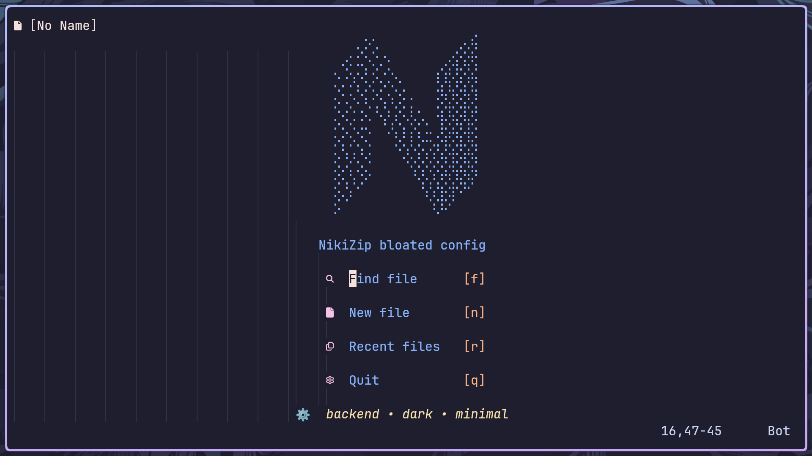

⚡ NeoVim-NikiZip
Modern C++ & C# Development Environment for Neovim

https://img.shields.io/badge/Neovim-0.9+-blueviolet?logo=neovim
https://img.shields.io/badge/Lua-5.1-blue
https://img.shields.io/badge/clangd-17+-green
.NET](https://dotnet.microsoft.com/)
https://img.shields.io/badge/License-MIT-yellow.svg

    A fast, feature‑rich, and beautifully configured Neovim setup, finely tuned for modern C++ and C# / .NET development.
    Perfect for daily coding, large projects, or competitive programming – now with cross‑language support.

✨ Key Features

    🧠 Smart Code Intelligence – Powered by clangd (C++) and OmniSharp / csharp-ls (C#): go to definition, find references, rename symbols, code actions, and semantic highlighting.

    🔮 Intelligent Autocompletion – nvim-cmp + snippets for fast and accurate suggestions in both languages.

    🎨 Beautiful Syntax Highlighting – Tree‑sitter for C++, C#, and many other languages.

    🔍 Lightning Fast Navigation – telescope.nvim to find files, grep symbols, and search diagnostics.

    🧹 Auto‑Formatting – clang-format for C++, OmniSharp or LSP formatting for C# (on save or manually).

    📦 Project Management – Seamless integration with .sln and .csproj files via LSP.

    🧩 Modular & Modern – Built with lazy.nvim for blazing‑fast startup and easy customization.

🖥️ Visual Tour

    <em>⚡ Main workspace – C++ code with LSP diagnostics, autocompletion, and a clean UI (C# looks just as good!)</em> 

📋 Requirements

Before you begin, ensure your system meets the following requirements:
Tool	Minimum Version	Purpose	Check Command
Neovim	0.9+ (0.10+ recommended)	Core editor	nvim --version
Git	2.30+	Plugin management	git --version
curl	7.68+	Downloading plugins & LSPs	curl --version
clangd	15+	C++ LSP server	clangd --version
.NET SDK	8.0+	C# LSP (OmniSharp/csharp-ls) & build tools	dotnet --version
clang-format	(Optional)	C++ formatting	clang-format --version
Nerd Font	(Optional)	Icons and UI elements	(e.g., FiraCode Nerd Font)

    💡 Pro Tip: For the best experience, also install ripgrep (for Telescope live grep) and fd (for faster file finding).
    For C# – make sure dotnet is in your PATH. The LSP will be automatically installed via mason.nvim.

📦 Installation

Follow these steps to get up and running in no time.
1. Backup Your Existing Configuration (if any)
bash

mv ~/.config/nvim ~/.config/nvim.bak
mv ~/.local/share/nvim ~/.local/share/nvim.bak
mv ~/.local/state/nvim ~/.local/state/nvim.bak

2. Clone the Repository
bash

git clone https://github.com/nikitu0008-collab/NeoVim-NikiZip.git ~/.config/nvim

3. Install Plugins

Open Neovim. lazy.nvim will automatically download and install all required plugins.
bash

nvim

Wait for the installation to complete. You might see a message like [Lazy] Installing .... Once it's done, restart Neovim.

    Note: If you encounter any issues, ensure curl is installed and accessible. lazy.nvim requires curl to fetch plugins from GitHub.

4. Verify the Setup

Open a C++ file (main.cpp) and a C# file (Program.cs). Check that the appropriate LSP is attached by running:
vim

:LspInfo

You should see clangd (for C++) and omnisharp or csharp-ls (for C#) listed as active clients.
Try typing std:: in C++ or Console. in C# – the autocompletion menu should appear.
🛠 Customization

This configuration is built to be easily customizable. All settings are organized in the lua/ directory.

    Change Colorscheme – Edit lua/plugins/theme.lua (or similar) and replace the theme.

    Add LSP Servers – Modify lua/lsp.lua to include additional LSPs (e.g., pyright, rust_analyzer).

    Adjust clangd Flags – Create a .clangd file in your project root:
    yaml

    CompileFlags:
      Add: [-std=c++20, -Iinclude]

    C# Project Settings – The LSP will automatically pick up your .sln or .csproj. For advanced OmniSharp configuration, see lua/lsp/omnisharp.lua.

🙏 Acknowledgements

This configuration stands on the shoulders of giants. Special thanks to the creators of:

    Neovim

    lazy.nvim

    clangd

    OmniSharp

    nvim-lspconfig

    nvim-cmp

    telescope.nvim

    nvim-treesitter

📝 License

This project is distributed under the MIT License. See the LICENSE file for more information.

⭐ If you find this configuration useful, please consider giving it a star on GitHub!
